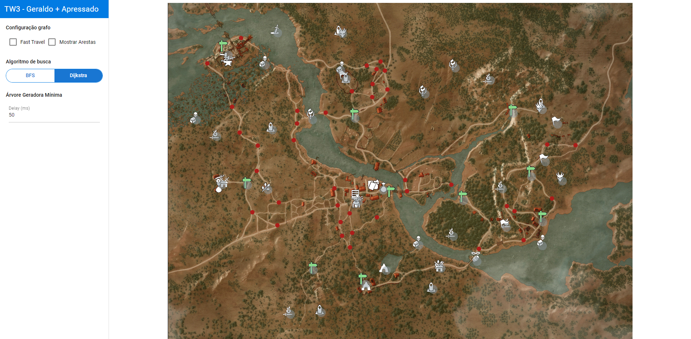
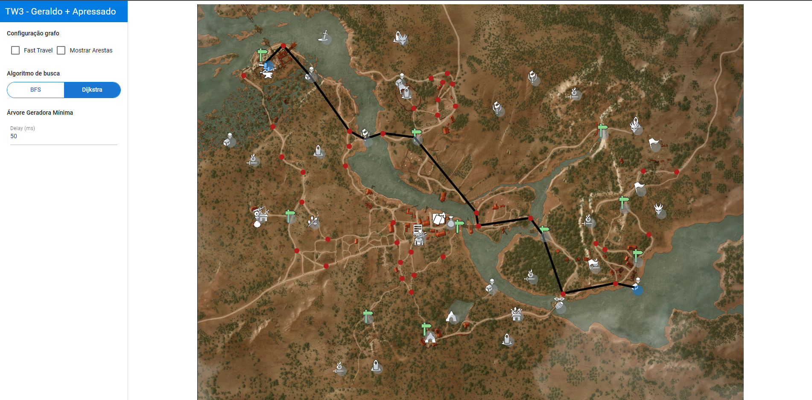
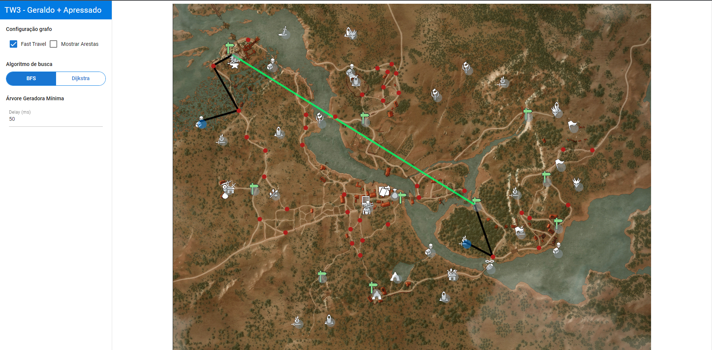
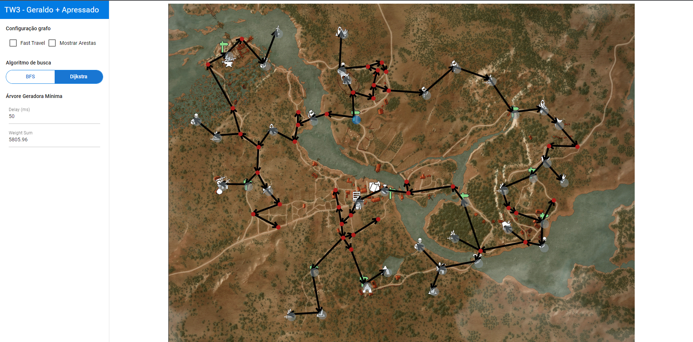
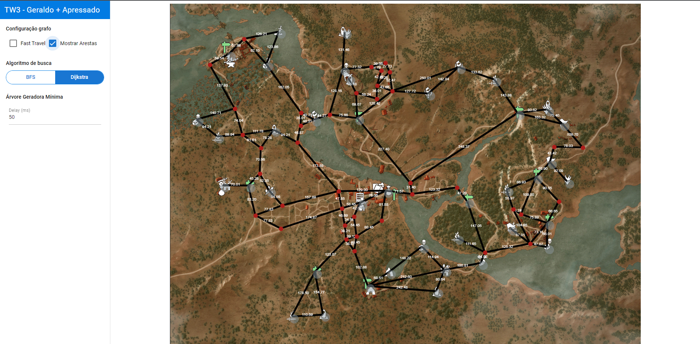

# Witcher 3 - Geraldo Apressado

**Número da Lista**: X<br>
**Conteúdo da Disciplina**: Grafos 2<br>

## Alunos
|Matrícula | Aluno |
| -- | -- |
| 18/0018728  |  Igor Batista Paiva |
| 18/0028260  |  Thiago Aparecido Lopes Santos |

## Sobre
O projeto consiste em um mapa da região de *White Orchard* do jogo *The Witcher 3*, onde o objetivo é demonstrar qual é o menor caminho entre dois pontos do mapa e/ou exibir a árvore geradora mínima a partir de algum ponto do mapa.

### Algoritmos utilizados

- Busca
  - Dijkstra
  - Breadth First Search (BFS)
- Árvore geradora mínima
  - Prim

*[The Witcher 3 - White Orchard](https://witcher.fandom.com/wiki/White_Orchard)*

O vídeo da apresentação pode ser encontrado clicando [aqui](https://github.com/projeto-de-algoritmos/Grafos2_Witcher_3_Geraldo_Mais_Apressado/blob/c9cb0db305876c3cb251bfcd239442dda949d2fc/pa_grafos2_presentation.mp4?raw=true).

## Screenshots
### Página Inicial


### Exemplo em funcionamento (menor caminho entre dois pontos Dijkstra)


### Exemplo em funcionamento (menor caminho entre dois pontos BFS com fast travel)


### Exemplo em funcionamento (árvore geradora mínima Prim)


### Exemplo em funcionamento (todas as arestas com custos)


## Instalação
**Linguagem**: JavaScript<br>
**Framework**: Vue.JS<br>
Para executar, primeiramente é necessário ter o [yarn](https://classic.yarnpkg.com/lang/en/docs/install) instalado.

Posteriormente, execute:

```
yarn
```

para a instalação das dependências e:

```
yarn quasar dev
```

para iniciar o projeto.

## Uso
Após iniciar o projeto, acesse seu [localhost](http://localhost:8080/), e na página inicial você terá acesso a uma representação do mapa do jogo.
Note que o mapa possui pontos vermelhos e azuis que simbolizam os nós do grafo.

Para que seja exibido o menor caminho entre 2 pontos no mapa, basta selecionar dois nós dispostos no mesmo, sendo que o primeiro nó representará o ponto de partida, e o segundo representará o ponto de chegada. Após a seleção de ambos, um dos menores caminhos possíveis entre os dois nós será desenhado no mapa por meio de retas. Para desfazer a seleção, basta clicar em qualquer lugar do mapa.

Para que seja exibida a árvore geradora mínima, basta clicar duas vezes em algum nó, este nó representará o nó de início do algoritmo de Prim. Para desfazer a seleção, basta clicar em qualquer lugar do mapa.

Existem algumas opções selecionáveis à esquerda, sendo elas:

- Fast Travel

As placas verdes dispostas no mapa representam pontos de viagem rápida (Fast Travel). Isso significa que o jogador pode ir de um ponto de viagem rápida a outro sem passar pela estrada, fazendo com que seja possível que o caminho entre dois determinados pontos seja mais rápido.

- Mostrar Arestas

Esta opção desenha todas as arestas entre os nós, fazendo com que o mapa fique totalmente preenchido. Para remover as arestas desenhadas basta desmarcar a opção.

- Algoritmo de Busca

Esta opção permite selecionar o algoritmo de busca que será utilizado: BFS ou Dijkstra.

- Delay

Esta opção permite alterar o intervalo entre o desenho de cada arestada definida para árvore geradora mínima.

E existe uma opção não selecionável que é exibida após iniciar o desenho da árvore geradora mínima:

- Soma custos

Esta opção exibe a soma dos custos de todas as arestas presentes na árvore geradora mínima.

## Outros

### Definição do custo

O cálculo do custo é realizado considerando a distância entre os nós e se a aresta passa por um caminho fora da estrada (selvagem).
