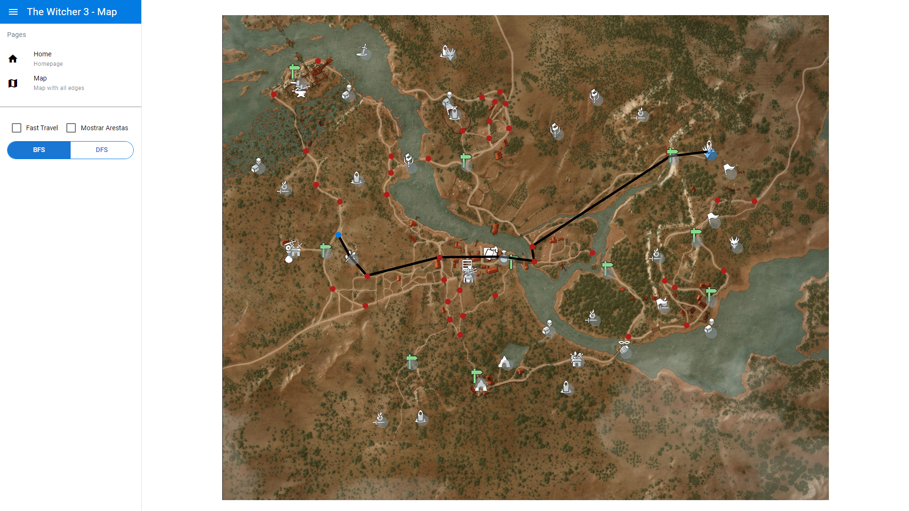
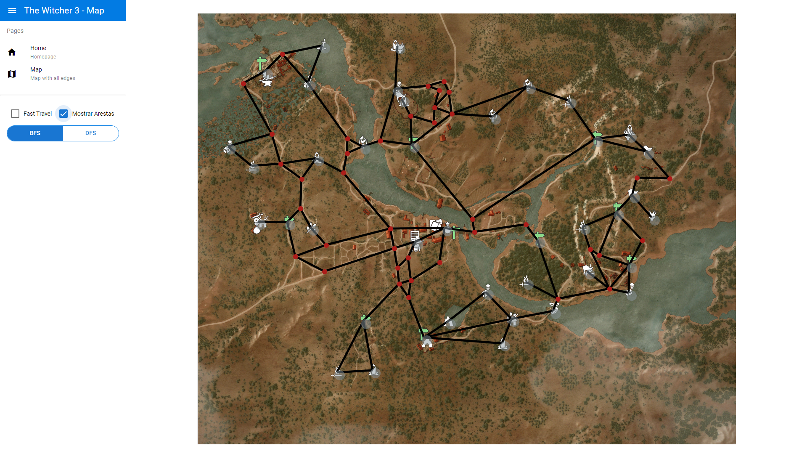

# Witcher 3 - Geraldo Apressado

**Número da Lista**: X<br>
**Conteúdo da Disciplina**: Grafos 1<br>

## Alunos
|Matrícula | Aluno |
| -- | -- |
| 18/0018728  |  Igor Batista Paiva |
| 18/0028260  |  Thiago Aparecido Lopes Santos |

## Sobre
O projeto consiste em um mapa da região de *White Orchard* do jogo *The Witcher 3*, onde o objetivo é demonstrar qual é o menor caminho entre dois pontos do mapa utilizando o algoritmo Breadth First Search (BFS).

*[The Witcher 3 - White Orchard](https://witcher.fandom.com/wiki/White_Orchard)*

O vídeo da apresentação pode ser encontrado clicando [aqui](https://github.com/projeto-de-algoritmos/Grafos1_Witcher_3_Geraldo_Apressado/blob/c9cb0db305876c3cb251bfcd239442dda949d2fc/pa_grafos1_presentation.mp4?raw=true).

## Screenshots
### Página Inicial


### Exemplo em funcionamento (menor caminho entre dois pontos)


### Exemplo em funcionamento (todas as arestas preenchidas)


## Instalação
**Linguagem**: JavaScript<br>
**Framework**: Vue.JS<br>
Para executar, primeiramente é necessário ter o [yarn](https://classic.yarnpkg.com/lang/en/docs/install) instalado.

Posteriormente, execute:

```
yarn
```

para a instalação das dependências e:

```
yarn quasar dev
```

para iniciar o projeto.

## Uso
Após iniciar o projeto, acesse seu [localhost](http://localhost:8080/), e na página inicial você terá acesso a uma representação do mapa do jogo.
Note que o mapa possui pontos vermelhos e azuis que simbolizam os nós do grafo.

Para interagir com o mapa, basta selecionar dois nós dispostos no mesmo, sendo que o primeiro nó representará o ponto de partida, e o segundo representará o ponto de chegada. Após a seleção de ambos, um dos menores caminhos possíveis entre os dois nós será desenhado no mapa por meio de retas. Para desfazer a seleção, basta clicar em qualquer lugar do mapa.

Existem duas opções selecionáveis à esquerda, sendo elas:

- Fast Travel

As placas verdes dispostas no mapa representam pontos de viagem rápida (Fast Travel). Isso significa que o jogador pode ir de um ponto de viagem rápida a outro sem passar pela estrada, fazendo com que seja possível que o caminho entre dois determinados pontos seja mais rápido.

- Mostrar Arestas

Esta opção ativa todas as arestas entre os nós, fazendo com que o mapa fique totalmente preenchido.

## Outros

### Disclaimer

Por utilizar BFS, o algoritmo leva em consideração apenas a quantidade de arestas entre os dois pontos para mostrar o menor caminho, e não a menor distância de fato entre um ponto e outro. Dessa maneira, pode haver casos em que existam caminhos visivelmente menores entre dois pontos, porém nunca com menor quantidade de arestas.
